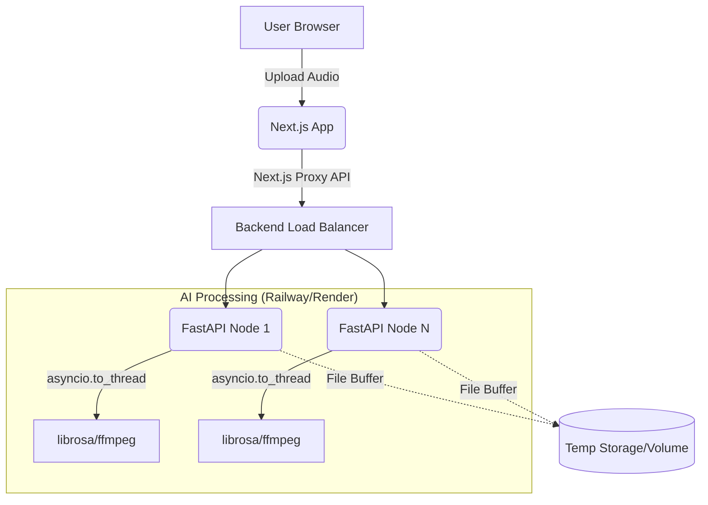

# CflatMinor Deployment & Architecture Guide

Welcome to the production deployment guide for **CflatMinor**, a world-class AI music analysis platform. This guide will walk you through the deployment process for both the Next.js frontend (Vercel) and the FastAPI/librosa backend (Railway/Render).

---

## System Architecture



### Key Architectural Decisions
1. **Frontend-Proxy**: We use Next.js API Routes (`/api/analyze`) as a proxy to prevent CORS issues, hide the backend URL, and handle request timeouts gracefully.
2. **Backend Thread-Pool**: Audio processing with `librosa` is CPU-bound. We use `asyncio.to_thread()` in FastAPI to prevent blocking the ASGI event loop.
3. **Decoupling**: The Next.js app and FastAPI app are deployed independently, allowing the computationally expensive backend to scale on CPU-optimized instances while the frontend scales on Edge networks.

---

## 1. Deploying the Backend (FastAPI)

The backend is built with FastAPI, Librosa, and FFmpeg. We recommend deploying to **Railway.app** or **Render.com** because they support Dockerfiles, which are required to install system dependencies like FFmpeg.

### Railway Deployment Steps
1. Create a GitHub repository for the `backend/` directory.
2. Go to **Railway.app** and click "New Project" -> "Deploy from GitHub repo".
3. Add a `Dockerfile` to the root of your backend repo:
   ```dockerfile
   FROM python:3.11-slim
   
   # Install ffmpeg
   RUN apt-get update && apt-get install -y ffmpeg && rm -rf /var/lib/apt/lists/*
   
   WORKDIR /app
   COPY requirements.txt .
   RUN pip install --no-cache-dir -r requirements.txt
   
   COPY . .
   
   # Expose port
   EXPOSE 8000
   
   # Start the app
   CMD ["uvicorn", "app.main:app", "--host", "0.0.0.0", "--port", "8000", "--workers", "4"]
   ```
4. Set the `PORT` environment variable to `8000` (or let Railway auto-detect).
5. Deploy. Ensure you scale the service to use adequate memory (at least 1GB RAM is recommended for audio processing).

---

## 2. Deploying the Frontend (Next.js)

The frontend is built with Next.js 16+, Shadcn UI, and TailwindCSS. The easiest way to deploy it is via **Vercel**.

### Vercel Deployment Steps
1. Push your root directory (containing Next.js files) to a GitHub repository.
2. Go to **Vercel.com** and import the repository.
3. Vercel will automatically detect the Next.js framework.
4. **Environment Variables**:
   Add the following environment variable to point to your deployed Railway backend:
   ```env
   NEXT_PUBLIC_API_URL=https://your-railway-app-url.up.railway.app
   ```
5. **Install Commands**: Make sure your `package.json` has `npm install` and `npm run build`. Vercel handles this automatically.
6. Click **Deploy**.

---

## 3. Production Considerations

### File Upload Limits
- **Vercel Function Limit**: Vercel Serverless Functions have a 4.5MB upload limit on the Free tier. If you plan to accept files up to 50MB, you must bypass the Next.js API proxy and upload directly from the browser to the FastAPI backend, or use a signed URL upload to AWS S3/Supabase Storage.
- **Alternative Upload Flow**:
  1. Frontend asks Backend for a presigned S3 URL.
  2. Frontend uploads file directly to S3.
  3. Frontend triggers Backend to download from S3 and analyze.

### Scaling the Backend
Audio processing is extremely memory and CPU intensive. For production:
- Increase the number of Uvicorn workers (`--workers 4`).
- Use a message queue (Celery + Redis) to handle jobs asynchronously if users report timeouts. Instead of making them wait 60s for an HTTP response, return a `job_id` and have the frontend poll for completion.

### Error Monitoring
Ensure you integrate Sentry or a similar APM tool to catch runtime errors on both ends, specifically:
- Out of memory (OOM) errors during Librosa load.
- Corrupted MP3/FLAC decoding failures.
